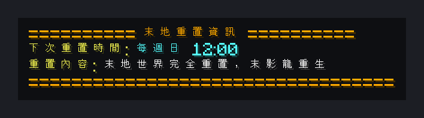

# Weekly End Reset

**English** | [繁體中文](README.zh-TW.md)

Regenerates The End every Sunday at 12:00 with countdown warnings, moves players out first and announces a new dragon fight. Includes a manual reset command and a small time-format test helper.

> This repository has two editions of the same script: **繁體中文 (zh-TW)** is the original used on the author's Traditional Chinese server, and **English** is a full translation (commands, messages and variable names) with the same features.

<!-- BEGIN LIVE SCREENSHOTS -->

## Screenshots

*`/末地下次重置時間` showing the schedule. Only this read-only query was run; the destructive op-only reset command was deliberately not executed.*

> These are live-server captures, not native client screenshots. A headless client logged into a real Paper 26.2 server, triggered the script, and the block / UI data the server sent back was re-rendered using the official Minecraft 26.2 client assets. Mojang/Microsoft image assets are not covered by this repository's code licence.

<!-- END LIVE SCREENSHOTS -->

## Features

- Warnings at 11:30, 11:50, 11:55 and 11:59 every Sunday
- Teleports everyone in `world_the_end` to the overworld spawn before resetting
- Regenerates The End with Multiverse-Core (`mv regen world_the_end --seed`)
- `/endresetinfo` for players, `/resetend` for admins
- Optional helper script with `/testtime` to check the time format the schedule relies on

## Requirements

- [Paper](https://papermc.io/) server (developed on Paper 26.2 / Minecraft 26.2)
- [Skript](https://github.com/SkriptLang/Skript) (developed on 2.16.2)
- [Multiverse-Core](https://modrinth.com/plugin/multiverse-core) 5.x with `confirm-mode: disable_console` in its `config.yml`

## Installation

1. Install the plugins listed under [Requirements](#requirements).
2. Download **one** edition:

   | Edition | File(s) |
   |---|---|
   | English | [`en/weekly-end-reset.sk`](en/weekly-end-reset.sk) [`en/test-time-format.sk`](en/test-time-format.sk) (optional helper) |
   | 繁體中文 (original) | [`zh-TW/末地每週重置腳本.sk`](zh-TW/%E6%9C%AB%E5%9C%B0%E6%AF%8F%E9%80%B1%E9%87%8D%E7%BD%AE%E8%85%B3%E6%9C%AC.sk) [`zh-TW/測試時間格式腳本.sk`](zh-TW/%E6%B8%AC%E8%A9%A6%E6%99%82%E9%96%93%E6%A0%BC%E5%BC%8F%E8%85%B3%E6%9C%AC.sk) (optional helper) |

3. Copy the `.sk` file(s) into `plugins/Skript/scripts/` on your server.
4. Run `/sk reload weekly-end-reset` (use the file name you copied) or restart the server.

> [!IMPORTANT]
> Install **only one** edition. Both editions are the same script in different languages - loading both makes them clash or run twice.

## Commands

| Command (English edition) | zh-TW edition | Description | Permission |
|---|---|---|---|
| `/resetend` | `/重置末地` | Reset The End now | OP |
| `/endresetinfo` | `/末地下次重置時間` | Show when The End is reset | everyone |
| `/testtime` | `/testtime` | Print the current time and weekday format (helper script) | OP |

## Configuration

- The world names (`world_the_end`, `world`), the day (`"Sunday"`) and the times are in the `every minute` block and the `/resetend` command.

## Notes

- The schedule compares `now formatted as "EEEE"` with `"Sunday"`, which depends on the JVM locale. Run `/testtime`: if the weekday isn't printed as `Sunday` (for example `星期日`), change the string in the script to what `/testtime` prints.
- Times use the server's local time zone.
- The helper script is optional and can be deleted after use.

## Related projects

- [skript-end-party-mode](https://github.com/Im-Tim-mI/skript-end-party-mode) - End Party Mode

## License

**MIT + Commons Clause** - see [LICENSE](LICENSE) for the full text.

- ✅ You may use, copy, modify and share this script.
- ✅ You **may** install and run it - including modified versions - on Minecraft servers that charge money or are run for profit.
- ❌ You may **not** sell the script itself or modified versions of it, directly or indirectly, or require payment to obtain its files or source code.

Copyright (c) 2026 廷廷小教室、廷廷的家（Tim945）
